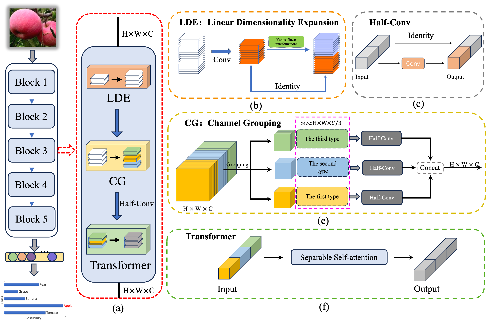
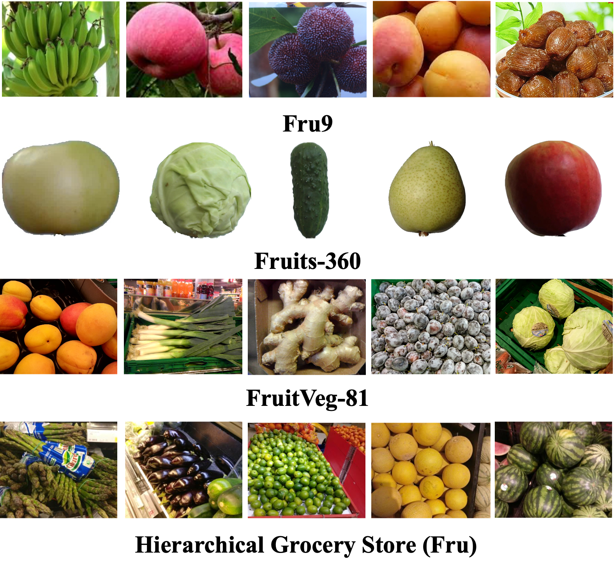
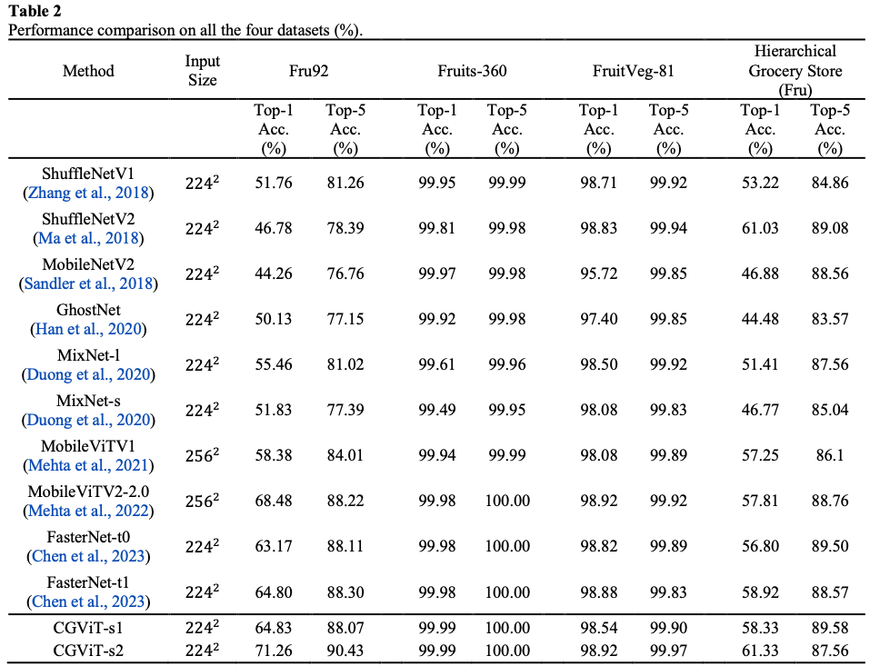

# CGViT
### Abstract

1、We adopt a Channel Grouping Vision Transformer (CGViT) for lightweight fruit and vegetable recognition.

2、We benchmark various lightweight deep learning networks on these four fruit datasets.

3、Evaluations on four fruit and vegetable datasets demonstrate that our approach achieves state-of-the-art performance while consuming fewer resources.

### Network structure
 

### Images from different datasets
 

### Experimental Results

